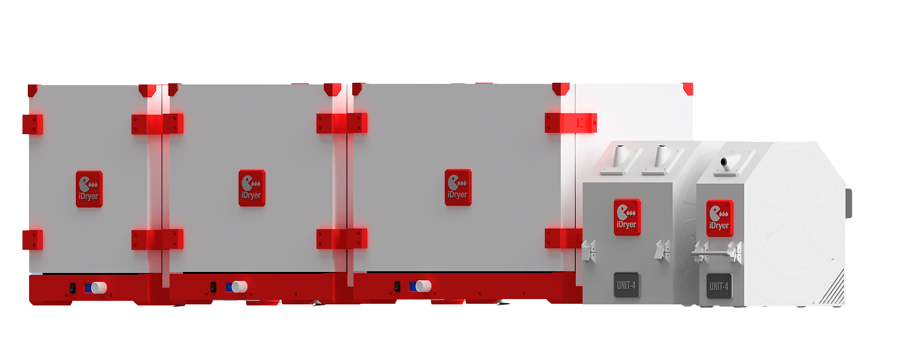

# Ecossistema iDryer

## Sobre o projeto

iDryer é um **ecossistema aberto** para secagem de filamento e melhoria da qualidade da impressão 3D. O projeto inclui hardware, firmware, portal em nuvem e aplicativo móvel, criados para entusiastas de impressão 3D e evoluindo através de suas ideias, discussões e necessidades.

Toda a documentação, código-fonte e esquemas estão disponíveis abertamente. Você pode construir seu próprio dispositivo, modificar o firmware, integrá-lo ao seu sistema, compartilhar experiências e contribuir para o desenvolvimento do projeto.

## Produtos principais

### iDryer
Um dispositivo para armazenamento e secagem de filamento com controle preciso de umidade e temperatura. Suporta todos os principais tipos de plásticos — desde PLA e PETG até materiais de alta temperatura (ABS, Nylon, policarbonato e outros). A temperatura de secagem é totalmente ajustável dependendo do seu tipo de filamento e objetivos — desde modos suaves até 110°C e acima. O design é modular: você constrói o dispositivo para atender suas necessidades e orçamento, desde um simples secador de mesa até um sistema integrado de gerenciamento para uma frota inteira de impressoras.

- **Montagem**: instruções detalhadas, lista de peças, esquemas
- **Firmware**: código-fonte, personalização para seu dispositivo
- **Integrações**: Klipper, Home Assistant, soluções personalizadas

### iHeater
Um sistema de aquecimento modular para câmaras de impressoras 3D. Fornece temperatura estável para materiais de alta temperatura (Nylon, PEEK, policarbonato e outros). Integra-se com Bambu Lab, Klipper e outras plataformas. Gerenciado através do portal iDryer — monitore a temperatura em tempo real, receba alertas, configure perfis para cada material.

### iDryer Storage
Sistema de gerenciamento de armazenamento de filamento. Permite que você mantenha seu inventário em perfeita ordem sem precisar se lembrar dos endereços das prateleiras — simplesmente coloque o carretel em seu local, o sistema mostrará onde. O portal armazena localização, status, data de abertura e histórico de uso, e peso real.

### iDryer Portal & App
Uma plataforma unificada para monitoramento e gerenciamento de todos os dispositivos no ecossistema.
**Recursos principais:**

- **Base de conhecimento de filamentos**: integrada com o fórum da comunidade — análises de materiais, experiências de usuários, recomendações em um único lugar
- **Predefinições**: compartilhe perfis de secagem e impressão para cada filamento, veja o que funciona melhor
- **Dinâmica de secagem**: monitore a perda de umidade em tempo real, acompanhe a correlação entre parâmetros de secagem e qualidade de impressão
- **Verificação de dispositivos**: cada secador recebe um identificador único, garantindo conformidade com parâmetros e qualidade de construção
- **Compartilhamento de resultados**: publique resultados de suas sessões de secagem junto com resultados de impressão — uma visão objetiva do que realmente funciona

O portal e o aplicativo móvel funcionam com um único banco de dados e sincronizam em tempo real.

---

**Comece**: selecione a seção que o interessa na navegação à esquerda.
